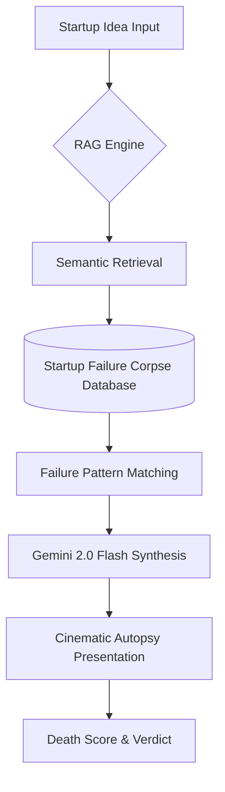

# 💀 Corporate Autopsy Machine: Forensic Startup Intel

[]()
[]()
[]()
[]()

An ultra-premium, AI-driven failure analysis engine designed to evaluate startup ideas with brutal honesty. This platform leverages a proprietary RAG (Retrieval-Augmented Generation) architecture to match your concept against a graveyard of 87+ real-world startup post-mortems with forensic visual clarity.

## 🩸 Design Philosophy: "The Forensic Standard"

This repository features a complete UI/UX overhaul inspired by forensic laboratories and digital crime scenes. We prioritized monospace precision, scanline animations, and reactive typography to deliver an experience that feels like a classified intelligence terminal.

### Key UX Pillars:
*   **The Intake Terminal**: A minimalist, high-contrast surface for feeding startup ideas into the machine.
*   **Death Meter Overlay**: A real-time SVG-based mortality probability gauge.
*   **Failure DNA Breakdown**: Visualizing lethal risk factors (CAC, Unit Economics, Market Timing) with vertical rhythm.
*   **Similar Corpses**: A curated graveyard list that semantically matches your idea with failed giants like Pets.com or Fab.com.

## ⚙️ Core Architecture

The system is built on a distributed RAG architecture ensuring lightning-fast retrieval and high-fidelity failure synthesis.



### 🧩 Backend (FastAPI)
*   **RAG Pipeline**: Utilizes Google Generative AI embeddings (`gemini-embedding-001`) to perform semantic search across indexed failure documents.
*   **LLM Synthesis**: Direct integration with `gemini-2.0-flash` for brutalist failure analysis and pivot strategizing.
*   **Auto-Seeding**: The engine automatically hydrates the vector database from a curated JSON corpus on startup.

### ⚛️ Frontend (React/Vite)
*   **High-Performance**: Built on Vite for near-instant interaction response times.
*   **Fluid Motion**: Custom-built CSS animations for data scanning and terminal feed effects.
*   **Atomic Components**: A library of custom-built pill buttons and result cards standardized under a unified black/red/green design system.

## 🚀 Quick Start (Local Development)

### 1. Intelligence Engine (Backend)
```bash
cd backend
pip install -r requirements.txt
# Configure your .env with GEMINI_API_KEY
uvicorn main:app --reload
```

### 2. Interface (Frontend)
```bash
cd frontend
npm install
npm run dev
```

## 🛠️ Features at a Glance
*   **Mortality Probability**: Automated risk scoring based on historical failure data.
*   **Cause of Death**: Detailed analysis of unit economics, burn rate, and product-market fit.
*   **Similar Corpses**: Live matching with historic startup failures.
*   **Strategic Pivots**: AI-generated survival paths derived from previous successful pivots.

## 📜 Credits & Licensing
*   **Original Engine**: Developed by [Shivam8292](https://github.com/Shivam8292)
*   **Research & Logic**: Built on real startup post-mortem data from the CB Insights graveyard.
*   **License**: MIT License

---
> **Note**: This project is designed for high-end startup risk assessment. Always verify market conditions beyond automated scoring.
